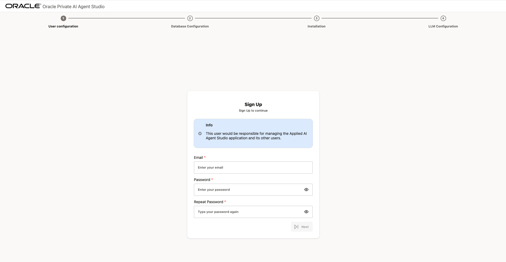

# Learn to install and deploy Oracle Private AI Agent Studio

## Introduction

In this lab session, we will show you how to install and deploy Oracle Private AI Agent Studio, a no-code platform that empowers business users and engineers to rapidly deploy intelligent agents, without writing a single line of code. The platform enables enterprises to launch smart assistants by leveraging Pre-built Agents, Custom-built Agents and End-to-end Workflows.

**Estimated time:** 10 minutes.

### Objectives

By the end of this lab, you will be able to:

- Prepare the installation environment.
- Deploy the Oracle Private AI Agent Studio application.
- Access Oracle Private AI Agent Studio application using a web browser.

### Prerequisites

- An Oracle Linux 8 virtual machine (VM) with terminal access and root/sudo privileges.
- Podman container engine (see our [installation guide](http://applied-ai-stage.oraclecorp.com:8000/get-started/setup.html) if needed).
- Access to an Oracle Pluggable Database (PDB) with SYSDBA credentials.
- Network access to the VM (including open port 8080 for web browser access).

## Task 1. Get installation files

First, create a staging location, which is a designated directory to store build artifacts such as executables and configuration files for creating Podman images.

Run the following commands to create and navigate to the staging location:

```bash
mkdir <staging_location>
cd <staging_location>
```

Download Oracle Private AI Agent Studio by running this command on your OL8 terminal:

```bash
wget https://artifacthub-phx.oci.oraclecorp.com/artifactory/ahf-generic-release-local/releases/applied-ai/23.0.0.2/applied_ai.tar.gz

```

After downloading `applied-ai.tar.gz`, extract its contents:

```bash
tar -xzf applied-ai.tar.gz
```

The extracted folder will contain several essential files. All of these files are essential for the installation and it is strongly recommended that you do not modify any of the files or the directory structure.

## Task 2. Prepare the database

Before installing Oracle Private AI Agent Studio, you must configure your database.

1. Log in as the SYSDBA user to your Pluggable Database (PDB) using SQL*Plus or your preferred tool.

2. Create the database user. Replace <DB_USER> and <DB_PASSWORD> with your desired credentials, then run the commands below.

    ```SQL
    CREATE USER <DB_USER> IDENTIFIED BY <DB_PASSWORD> DEFAULT TABLESPACE USERS QUOTA unlimited ON USERS;
    GRANT CONNECT, RESOURCE, CREATE SESSION, CREATE TABLE, CREATE SYNONYM, CREATE DATABASE LINK, CREATE ANY INDEX, INSERT ANY TABLE, CREATE SEQUENCE, CREATE TRIGGER TO <DB_USER>;
    GRANT READ, WRITE ON DIRECTORY DATA_PUMP_DIR TO <DB_USER>;
    GRANT SELECT ON V_$PARAMETER TO <DB_USER>;
    exit;
    ```

3. Log out.

Now, you need to Extend VARCHAR2. The `max_string_size` database parameter must be set to `EXTENDED` before running the application. Follow the next steps;

1. Log in as the SYSDBA user to your PDB using SQL*Plus or your preferred tool.

2. Check the current value of the parameter:

    ```SQL
    SELECT value FROM v$parameter WHERE name = 'max_string_size';```

3. If the output is already `EXTENDED`, no further action is needed. Otherwise, run the following script as the SYSDBA user. This sequence will restart the database.

    ```SQL
    ALTER SYSTEM SET max_string_size=extended SCOPE=SPFILE;

    SHUTDOWN NORMAL;
    STARTUP UPGRADE;

    @$ORACLE_HOME/rdbms/admin/utl32k.sql

    SHUTDOWN IMMEDIATE;
    STARTUP;

    @$ORACLE_HOME/rdbms/admin/utlrp.sql
    ```

4. Verify that the change was successful.

    ```SQL
    SELECT value FROM v$parameter WHERE name = 'max_string_size';
    ```

    The output of this query must be EXTENDED.

## Task 3. Environment setup

Prepare your environment by running the following command in your staging location:

```bash
make build
```

You will be prompted to select the installation mode. Please select "prod" by entering "1", and confirm your selection when prompted:

```bash
Select installation mode:
1) prod
2) quickstart
Enter choice (1 or 2): 1

Building the images necessary in Production mode

You selected Production mode. Confirm? (yes/no) [yes]: yes
```

Wait for a few minutes until the process is completed.

## Task 4. Launch the application

To start the application, please run the following command:

```bash
make up
```

this process may take a few minutes. Please wait until you see `✓ Production deployment complete.`.

## Task 5. Open Private AI Agent Studio

To begin using your instance of Oracle Private AI Agent Studio, navigate to `https://localhost:8080/studio/installation`. You should see a Sign Up page like the following.



## Summary

This concludes this module. The installation has been completed. The next modules will explore each feature of Oracle Private AI Agent Studio in more detail. Continue with them so you don't miss on new discoveries and learning opportunities.

## Acknowledgements

- **Author** - Emilio Perez, Member of Technical Staff, Database Applied AI
- **Last Updated By/Date** - Emilio Perez - August 2025
