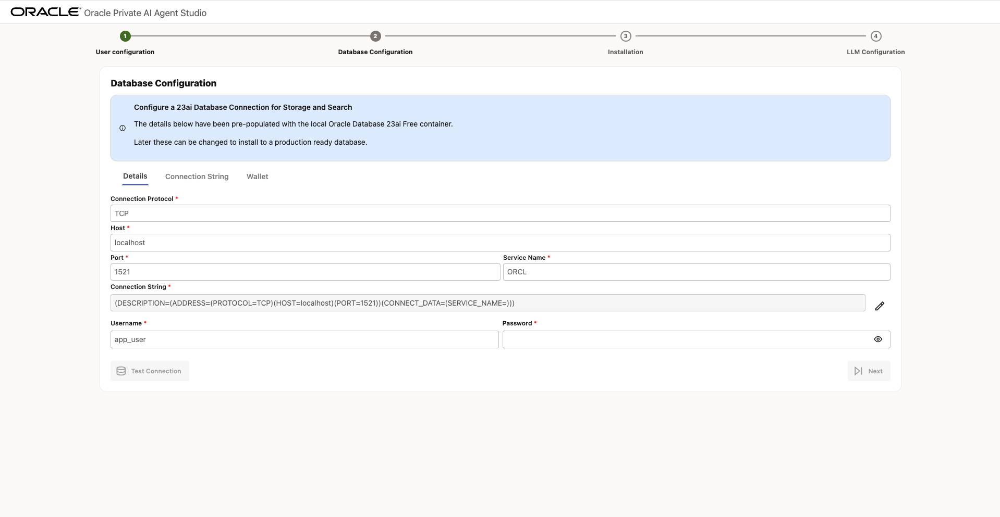
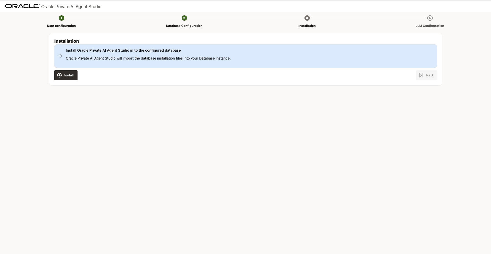
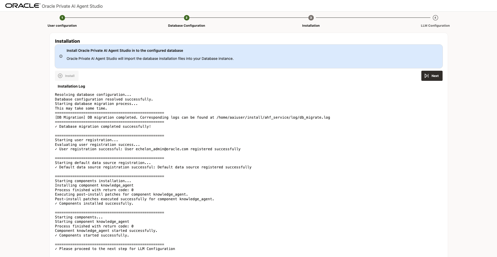
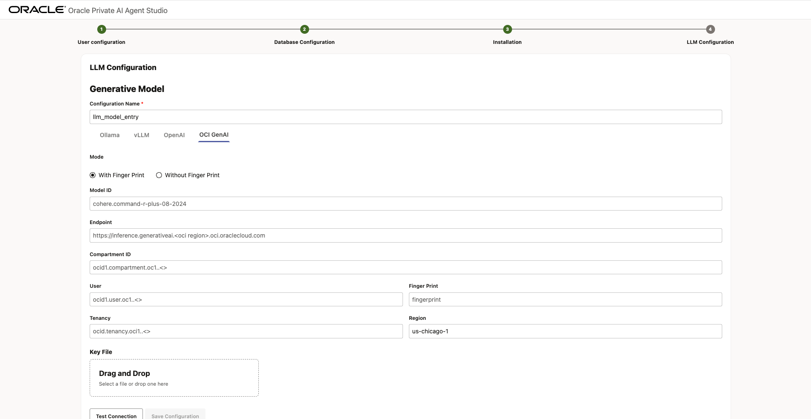
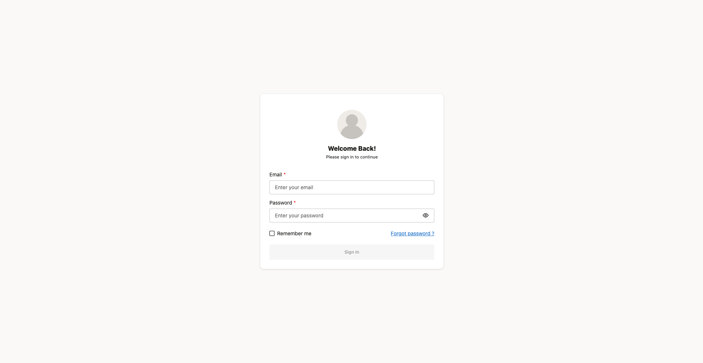

# Configure OCI GenAI services and Oracle Autonomous Database

## Introduction

In this lab, you will learn how to connect Oracle Database 23ai with LLM services to get the most out of Oracle Private AI Agent Studio.

**Estimated time:** 10 minutes.

### Objectives

By the end of this lab, you will be able to:

- Create a dedicated user account to manage Oracle Private Agent AI Studio.
- Configure secure connection between Oracle Database 23ai and Oracle Private AI Agent Studio.
- Install and initialize Oracle Private AI Agent Studio schema and tables in your database.
- Set up Large Language Model (LLM) credentials for use in the application.
- Log in and validate successful configuration of Oracle Private AI Agent Studio.

### Prerequisites

- **Oracle Database 23ai credentials**. You will need access to an instance of Oracle Database 23ai. It is recommended to create a dedicated user for this purpose. This user should be used exclusively for managing these tables and not for storing production data.

- **LLM credentials**. The Oracle Private AI Agent Studio relies on integration with a Large Language Model to function properly. You will require appropriate authentication credentials or an access key to connect the application with an available LLM instance of your choice.

## Task 1: User creation

Continuing from the previous module, you will now sign up for Oracle Private AI Agent Studio by creating a user account. You will need to set up an email and a securely stored password. This user will be responsible for managing the Oracle Private AI Agent Studio application and its other users.

## Task 2. Configure Application Data Database Connection

Next, connect to the database where application data will be stored. We strongly suggest creating a dedicated user for this purpose, separate from your production environment.

You can either enter the Oracle 23ai Database connection details directly, provide the connection string or upload a database wallet file.

After entering your credentials, click **Test Connection**. If the credentials are correct, a "Database connection successful" message will be displayed. Then click **Next**.

## Task 3. Database Installation

Proceed to install Oracle Private AI Agent Studio into the configured database.

Click **Install** and wait a few minutes for the setup to complete. When finished, you will see the message `✓ Please proceed to the next step for LLM Configuration`. Then press **Next**.

## Task 4. LLM Configuration

Select an LLM configuration based on your LLM provider. The application supports integration with Ollama, vLLM, OpenAI, and the full suite of OCI GenAI offerings. Depending on your select provider, the required connection credentials may differ.

Once all required fields are completed, test the connection using the **Test Connection** button. If the credentials are valid, a "Connection successful" message will appear. Then click **Save Configuration**.

Oracle Private AI Agent Studio also enables you to add a dedicated embedding model for various use cases. For this tutorial, this step is skipped. The configuration process for an embedding model is similar.

After saving the configuration and successfully connecting to the model, click **Finish installation**.

## Task 5. Log In

With the configuration complete, you will be prompted to log in with the email and password created in Task 1. After logging in, you will be greeted by the Get Started screen.

## Summary

This concludes the current module. Your configuration is now complete. The following modules will explore each feature of Oracle Private AI Agent Studio in greater detail. Continue with them so you don't miss on new discoveries and learning opportunities.

## Acknowledgements

- **Author** - Emilio Perez, Member of Technical Staff, Database Applied AI
- **Last Updated By/Date** - Emilio Perez - August 2025
