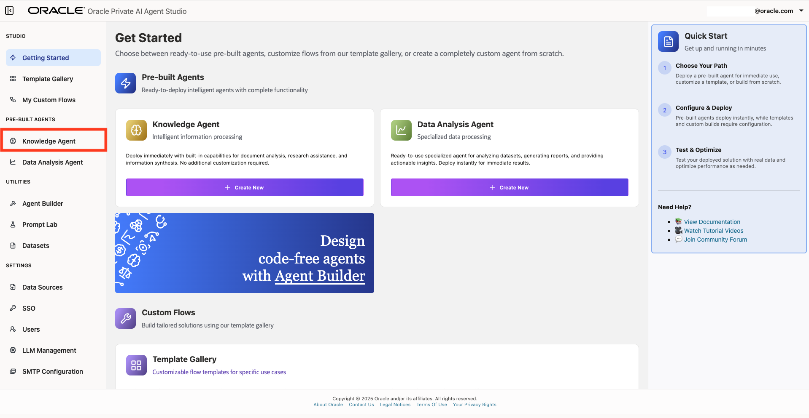
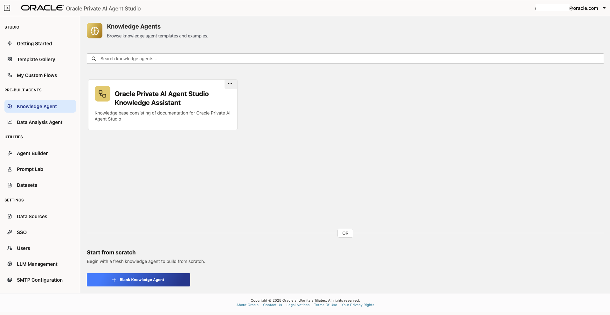
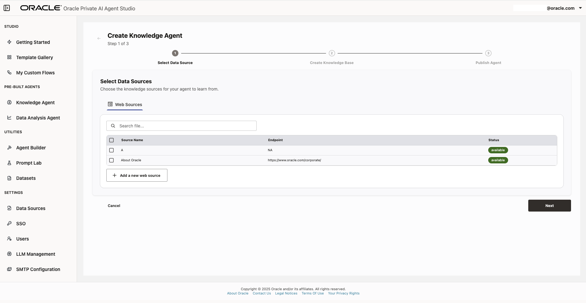
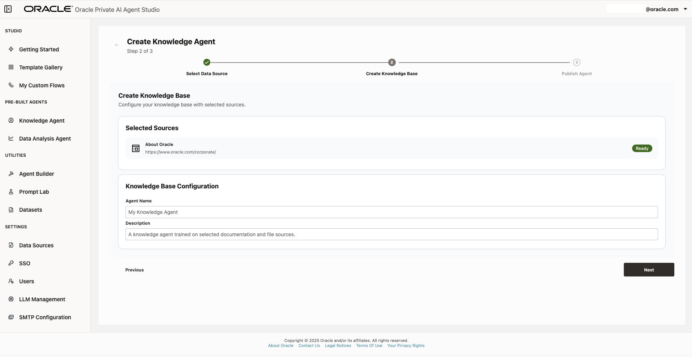
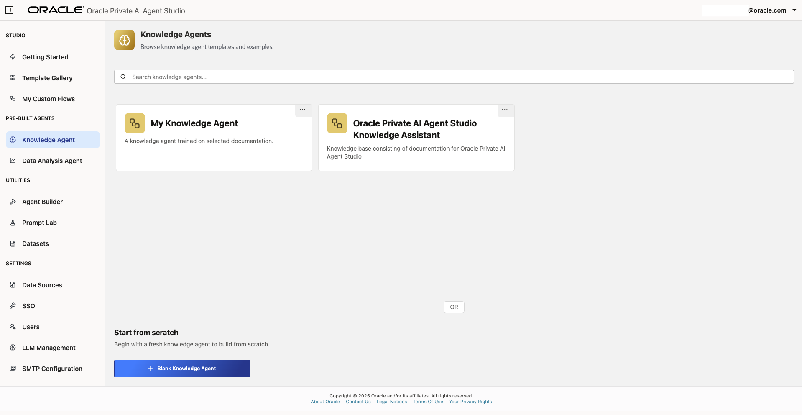
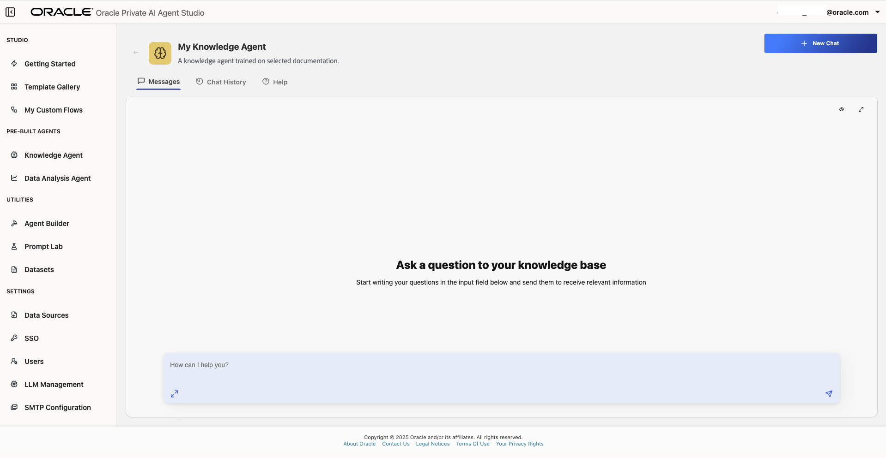

# Lab 5: Build agentic RAG on custom enterprise data with secure access

## Introduction

In this lab session, you will learn how to create Knowledge Agents and connect them to your data sources to safely access your enterprise data.

A **Knowledge Agent** is an AI agent that augments Vector Search & LLM capabilities with enterprise data, enabling accurate, context-rich responses by retrieving relevant information from internal knowledge bases, documents, or web-sources.

It is capable of contextual retrieval from unstructured sources and provides grounded responses traceable to enterprise-approved sources. The Knowledge Agent is integration-ready, allowing connections to internal sites, file systems, and more. It also supports un-authenticated web sources for broader knowledge retrieval.

**Estimated time:** 10 minutes.

### Objectives

By the end of this lab, you will be able to:

- Create a Knowledge Agent and define its Knowledge Base.
- Interact with a custom Knowledge Agent by asking questions and receiving responses based on your knowledge base.

### Prerequisites

To follow this tutorial, it is suggested that you have access to an Oracle Private AI Agent Studio environment with permissions to add and manage knowledge agents.

## Task 1: Create a Blank Knowledge Agent

In this task you will create a new blank Knowledge Agent.

1. Open Oracle Private AI Agent Studio and log in. In the sidebar, click the **Knowledge Agent** section.

    

    

2. At the bottom of the screen click **Blank Knowledge Agent**.
You will be prompted to choose a Web source data source. You can select the one created on Lab 4 or create a new one. This data source will be knowledge base for this agent. Click **Next** to continue.

    

3. The Knowledge Base Configuration setup form will be displayed. Assign an agent name and description to easily identify the agent you are creating. Click **Next**, then **Publish Agent** to continue.

    

4. Wait a few moments while the agent is being published. After that you will be able to see it on the Knowledge Agent gallery.

## Task 2: Chat with your custom Knowledge Agent

Continuing from where the last task left off, click the recently created Knowledge Agent.

Here, you will be able to interact with the agent by asking questions and receiving grounded answers based on the ingested data from its knowledge base.

## Summary

This concludes the current module. You now know how to create Knowledge Agents with custom knowledge bases and interact with them to get grounded, specific information in an air-gapped environment. The next module will further explore other features of Oracle Private AI Agent Studio. Continue with them so you don't miss on new discoveries and learning opportunities. You may now **proceed to the next lab**.

## Acknowledgements

- **Author** - Emilio Perez, Member of Technical Staff, Database Applied AI
- **Last Updated By/Date** - Emilio Perez - August 2025
