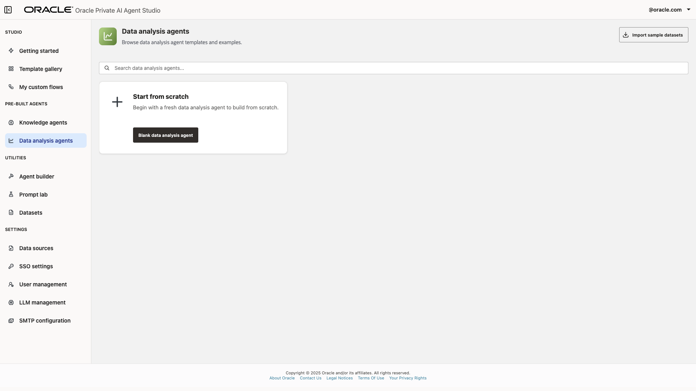
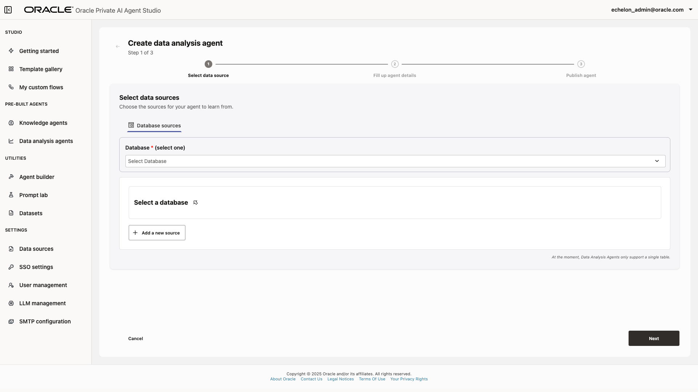
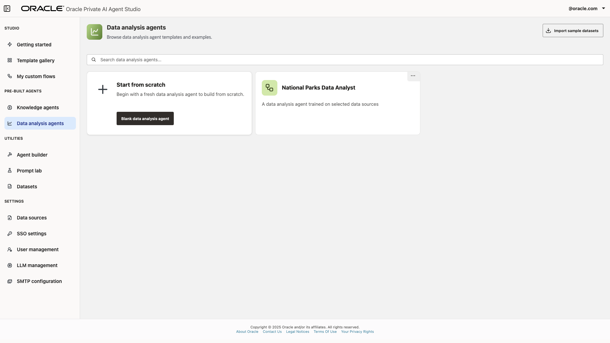

# Explore Data Analysis Agent to enable RAG on structured data using variation analysis

## Introduction

In this lab session, you will learn how to create Data Analysis Agents and connect them to your data sources to safely access and get accurate interpretations of your enterprise data.

A **Data Analysis Agent** interacts with enterprise databases, understands schema structures, and automatically extracts semantic insights using LLM capabilities.

These agents are capable of generating semantic and data-relevant questions through variation analysis, providing LLM-powered explanations, and automatic visualization generation. They are integration-ready and can connect to a variety of supported structured data sources like Oracle Database 19c and above.

> Note: The screenshots in this lab use an example “Production Database” and “NATIONAL_PARKS” table for illustration purposes. You may use any database and table accessible within your environment when following these steps.

**Estimated time:** 15 minutes.

### Objectives

By the end of this lab, you will be able to:

- Set up a Data Analysis Agent and link it to a designate enterprise data source.
- Configure agent metadata to ensure accurate data representation and usability.
- Deploy the agent and interact with it to generate and interpret data-driven insights using natural language queries.

### Prerequisites

To follow this tutorial, it is suggested that you have access to an Oracle Private AI Agent Studio environment with permissions to add and manage Data Analysis Agents and connect to at least one structured data source.

## Task 1: Create Data Analysis Agent

In this task, you will create a custom Data Analysis Agent to work directly with your data.

1. Open Oracle Private AI Studio and log in. In the sidebar, click the **Data Analysis Agent** section.

    

    

2. Click the **Create Data Analysis Agent** button. A setup form will appear, allowing you to select the data source for this agent. (Note that, at this time, Data Analysis Agents only support a single table for analysis)

For this task, choose **Database Sources**, then use the "Select database" drop-down menu to pick an available enterprise database in your environment you want to work with. Similarly, select any table you would like to analyze from the "Select table" menu. Click the **Next** button to continue.

> The screenshots use an example database and table; your selections may differ based on what is available to you.

## Task 2: Fill Up Agent Details

On this screen, you can configure your Data Analysis Agent with the selected sources. The setup form allows you to provide an agent name and description to help users identify it, as well as a Help Description in Markdown format. This Help Description assists the LLM in better understanding the agent's purpose, enabling it to provide more accurate and relevant answers.

For this tutorial, use the following information:

For this tutorial, use information that describes your chosen data source. For example:

- **Agent Name**: [Your Agent Name] (e.g., “Sales Data Analyst”)
- **Description**: A data analysis agent for the selected data source.
- **Help Description**: A brief summary of the dataset (e.g., “A comprehensive dataset of quarterly sales results including region, product, and revenue data.”)

Click the **Next** button to continue.

You will see the Publish Agent screen, where you can review the information provided and deploy the Data Analysis Agent.

Click the **Publish Agent** button to proceed. Please wait a few seconds; you will be greeted with a success message. The newly created agent will then appear on the Data Analysis Agents Gallery.

## Task 3: Interact with your Data Analysis Agent

Click on the newly created agent to open a new chat. Here, you can interact with the agent and get answers based on your source data.

When you start a chat for the first time, it may take a few moments for the agent to review and interpret the information on the database. Once complete, several interesting insights will be displayed.

The agent will suggest some pertinent questions about the data and present the corresponding answers. Depending on the query, the responses may be in natural language text, visualizations, table, and regardless it will share the SQL statement used to generate the answers.

You can ask your own questions about the dataset with natural language, and the agent will provide an appropriate answer.

## Summary

This concludes the current module. You now know how to create Data Analysis Agents with your own structured data to obtain valuable insights in an air-gapped environment. The next module will further explore other features of Oracle Private AI Agent Studio. Continue with them so you don't miss on new discoveries and learning opportunities.

## Acknowledgements

- **Author** - Emilio Perez, Member of Technical Staff, Database Applied AI
- **Last Updated By/Date** - Emilio Perez - August 2025
