# Walk through the usage of the Template Gallery and Agent Builder features

## Introduction

In this lab session, you will learn how to leverage the Template Gallery and the Agent Builder within Oracle Private AI Agent Studio to accelerate your workflow with minimal setup.

**Estimated time:** 20 minutes.

### Objectives

By the end of this lab, you will be able to:

- Explore the Template Gallery to identify and utilize pre-built workflow templates for a wide range of automation scenarios.
- Learn how to import and configure templates to quickly deploy AI-powered agents.
- Familiarize yourself with the Agent Builder to visually design, assemble, and automate new workflows using diverse components.
- Gain hands-on experience in creating, testing, and refining your own workflows tailored to specific business needs.

### Prerequisites

To follow this tutorial, you need access to an Oracle Private AI Agent Studio environment with the necessary permissions to use Template Gallery features and Agent Builder tools. You should also have access to at least one data file (such as a PDF) and an LLM configuration that is available in your environment.

> Note: Screenshots in this tutorial use example files and configurations for illustration purposes. When following along, use resources that are available in your environment.

## Task 1: Create an agent from the Template Gallery

The Template Gallery offers a curated collection of pre-built agentic templates designed to help you get started quickly with intelligent automation.

Templates may include workflows for tasks such as document summarization, meeting note extraction, content transformation, and more. You can browse, search, and import any template that fits your needs, customizing them as needed with minimal configuration.


1. Open Oracle Private AI Agent Studio and log in. In the sidebar, click **Template Gallery**.

    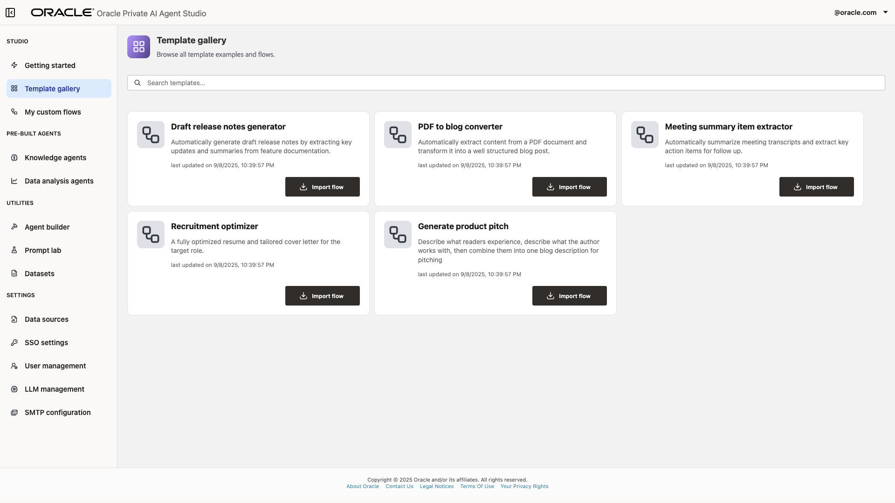

    Here you will find all prebuilt workflows currently offered by Oracle Private AI Agent Studio.

2. For this tutorial, we will use the "PDF to Blog Converter" as an example, but you are encouraged to explore other templates based on your needs. Select a template to continue.

    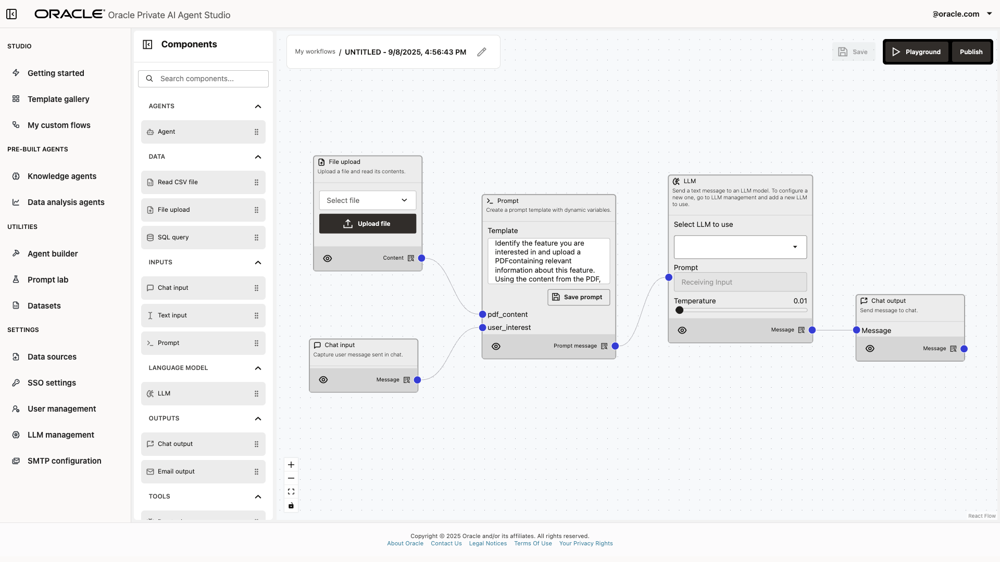

3. The prebuilt workflow will be displayed and can be customized using a simple drag-and-drop interface, no code required. To help identify the workflow, you can change its name in the top right corner of the canvas. For this example, type a name such as “Blog Post Generator” or another descriptive name of your choice.

    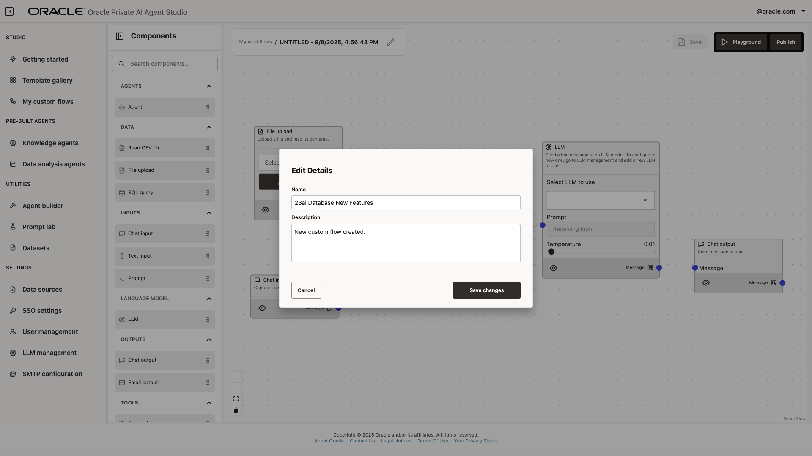

4. As part of this example workflow, you may be prompted to modify workflow components. For instance, you can remove a node by selecting it and pressing Delete, and you can add a new node (such as an LLM or agent) by dragging it from the palette and configuring it as needed.

    

    

    For any agent, supply an LLM configuration name that matches one set up in your environment.
    Connect nodes by dragging from the output of one node to the input of another as instructed.

    

    

5. Some templates are designed to process files as inputs, such as PDF files. If the template requires it, use the **Upload File** function, select your file, and choose it from the dropdown.

    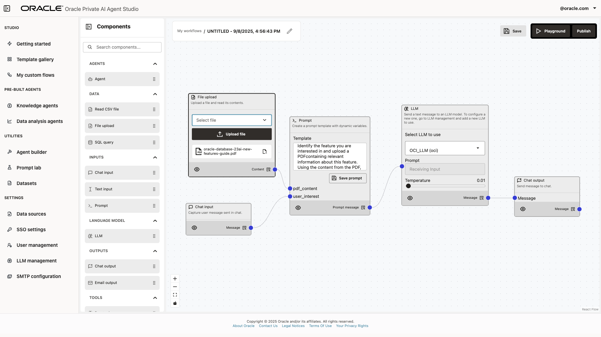

6. Click Publish to deploy your customized workflow.

    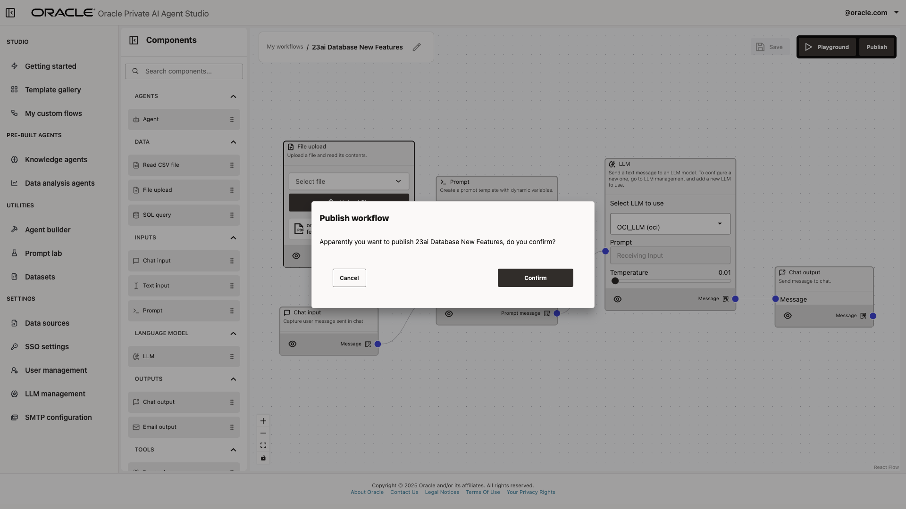

## Task 2. Interact with the created workflow

After publishing the workflow, go to your workflow gallery. In the sidebar, click **My Custom Workflows**.


Select your workflow from the gallery. Here, you can edit, delete, or run your custom workflows. To proceed, click **Run Flow**.


Interact with your workflow through the chat interface. Example query prompts will depend on your data source contents. For example, if your document is a product release guide, you could ask about new features described within. The workflow will provide responses based only on the information it has processed from your chosen file.


## (Optional) Task 3: Explore other templates

Explore additional templates in the Template Gallery to reinforce your learning and discover further use cases. Each template is immediately customizable and can be adapted to a variety of scenarios.

## Task 4: Explore the agent builder

The Agent Builder enables you to design, orchestrate, and automate complex processes by combining modular components, such as language models, data connectors, APIs, and specialized agents, without the need for extensive programming.

With the Agent Builder, you can visually construct workflows by connecting nodes that represent specific actions, tools, or data sources using a straightforward drag-and-drop interface. This feature allows you to build intelligent workflows using components like LLMs, chat agents, and data processing tools. You can also define agents that autonomously perform tasks, make decisions, or interact with systems based on your workflows.

Workflows created with the Agent Builder can be seamlessly integrated with enterprise systems, third-party services, cloud APIs, and databases. They are reusable and can easily be modified to meet varying business requirements.

The following table explores the various types of nodes you can use in the Agent Builder to create custom workflows. You may mix and match them to tailor workflows to your specific goals.

| Type | Description |
|--|--|
| Language Model | *vLLM*: Node leveraging the vLLM (virtualized Large Language Model) system for fast, efficient LLM inference. |
| Agents | - *vLLM Agent*: Node utilizing a vLLM instance to carry out instructions, answer questions, or facilitate complex workflows. - *OCI Agent*: Node connected to Oracle Cloud Infrastructure (OCI) services, enabling use of models served by Gen AI Services. |
| Tools | *MCP Server*: Specialized node for interfacing with AI models using the Model Context Protocol (MCP). (SSE Only) |
| Inputs | - *Chat Input*: Designed for conversational user input in a chat-based interface. - *Text Input*: Receives plain text input directly from the user. - *Prompt*: For defining or modifying textual instructions sent to a language model. |
| Outputs | - *Chat Output*: Renders or returns model/agent responses in a chat interface. |
| Data | - *Read CSV*: Imports and parses CSV files for batch or tabular data processing. - *File Upload*: Allows users to upload files for processing or analysis. - *SQL Query*: Executes SQL statements against databases; returns results for workflow use. |

## Task 5: Create a custom workflow

In this task you will create a simple workflow to gain hands-on experience with the Agent Builder interface and its capabilities.

1. **Open Oracle Private AI Agent Studio and log in.**
    In the sidebar, click **Agent Builder**.

    

    

2. Add nodes.

    On the left side of the canvas, you will find the available nodes. Drag an Agent node (such as OCI Agent or vLLM Agent) onto the canvas. Configure it with an LLM configuration name from your environment.

    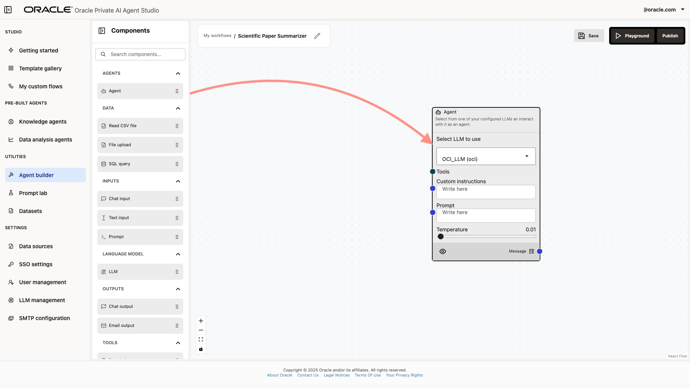

    On the top left corner of the canvas type a name for the workflow, such as "Scientific Paper Summarizer".

3. Connect nodes.

    Repeat the process and add a **Chat Output** node. On the Chat Output node, click on the blue edge and drag it until it connects with the right edge of the OCI/vLLM Agent node edge, as shown below.

    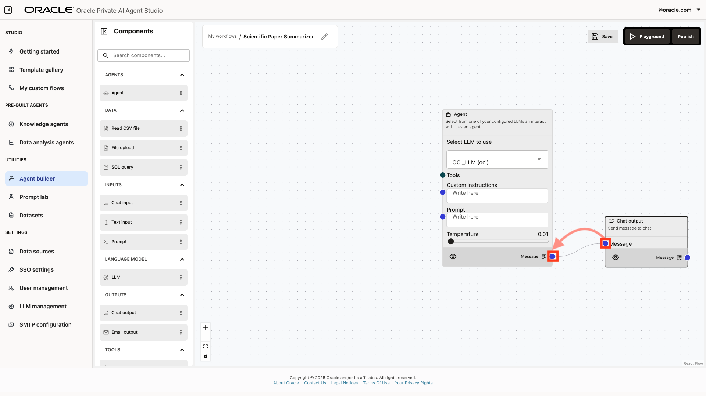

    If you need to remove a connection between two nodes, simply click the connecting line and press Delete on you keyboard.

    Add a **Chat Input** node as well, but do not connect it for now.

    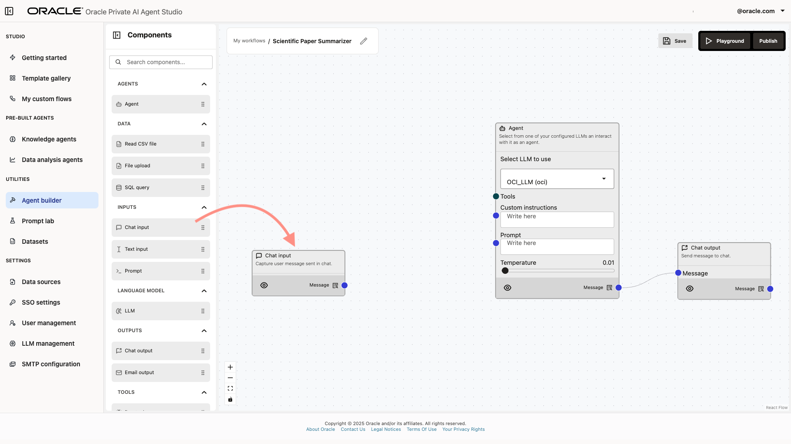

4. Enrich prompts.

    As previously mentioned, the Prompt node allows you to enrich the instructions provided to the AI.

    Add a **Prompt** node and enter instructions in the text box. If you wish to add variable information, encapsulate it in curly braces; this will automatically add a connection edge to the node once saved. Example:

    ```bash
    Given the provided text, extract all key information and important details. Use this information to automatically generate a easy to understand summary.
    Provided text : {{user_input}}
    ```

    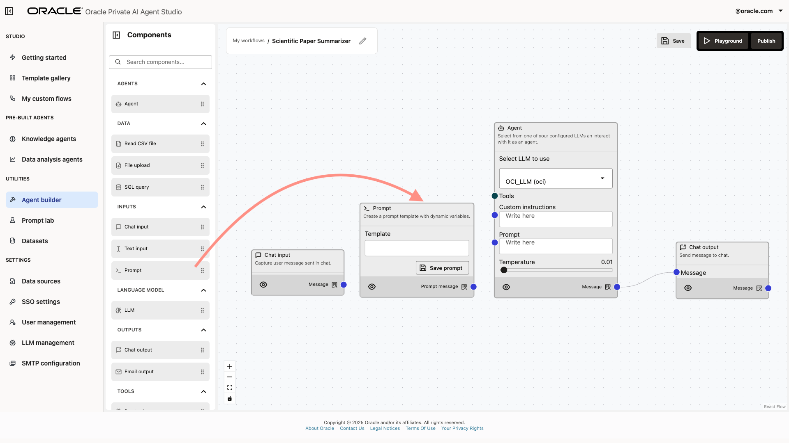

    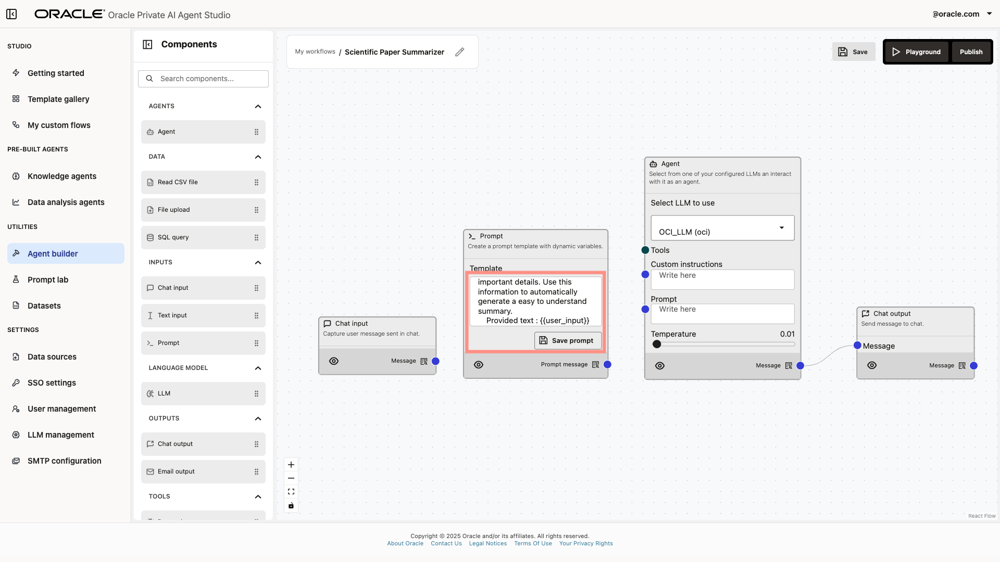

    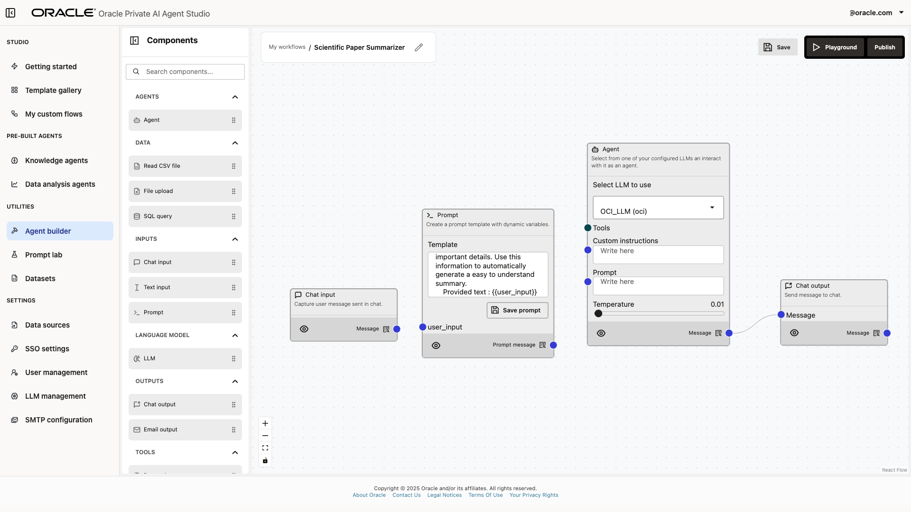

    Connect the nodes as illustrated so that the Chat Input feeds into the Prompt, which feeds into the agent node, which connects to the Chat Output.

    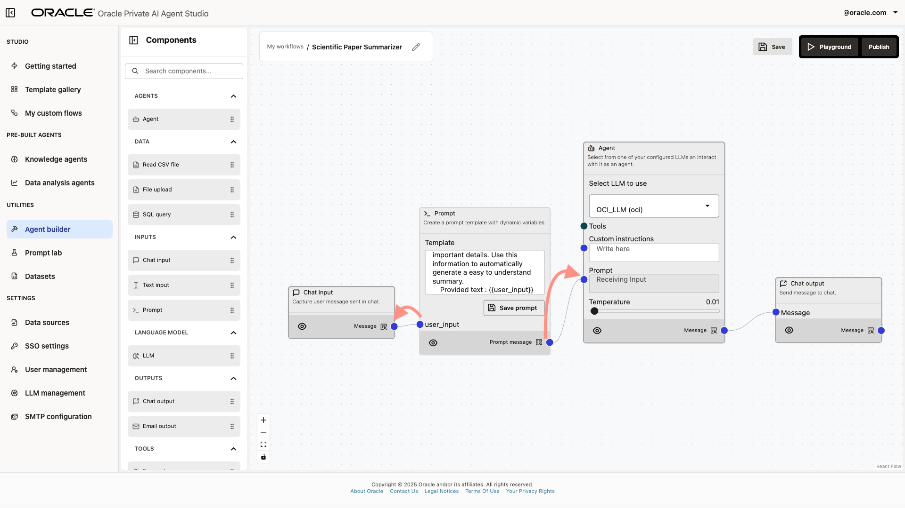

5. Save and test.

    Save the workflow by clicking the **Save** button in the top-right corner of the canvas. You can test the workflow before publishing it by clicking **Playground**. In the Playground, you may use test text or sample data relevant to your organization for input.

    

    

## (Optional) Task 6: Create your own custom workflow

Once comfortable, try designing a workflow of your own—tailor it to your data, business case, or automation scenario of interest.

## Summary

This concludes the current module. You now know how to use the Template Gallery to leverage pre-build workflows and hot to design your own custom workflows using the Agent Builder. These tools enable you to build, test and deploy advanced AI workflows tailored for your needs.

We hope this LiveLab has been illustrative and helpful to you in exploring and learning all of the features of Oracle Private AI Agent Studio. Explore additional modules for further discoveries and learning opportunities.

## Acknowledgements

- **Author** - Emilio Perez, Member of Technical Staff, Database Applied AI
- **Last Updated By/Date** - Emilio Perez - August 2025
